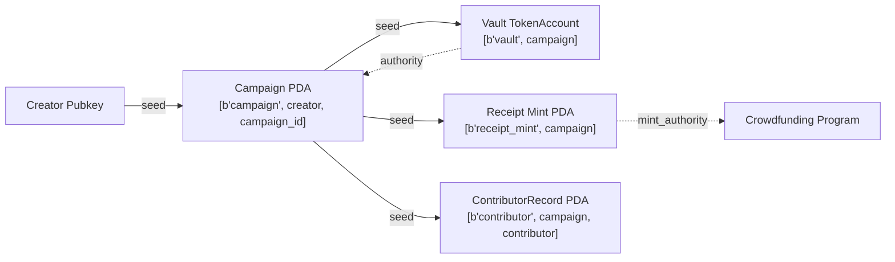

# Architecture Reference

This document is the canonical engineering reference for the multi-chain crowdfunding implementation.
It covers both the EVM (Solidity + Hardhat) and Solana (Anchor) variants and is intended to be
read alongside `docs/scope.md` and `docs/setup.md`.

---

## 1. Overview

Two blockchain platforms implement an identical crowdfunding state machine:

| Dimension | EVM (Solidity 0.8.20) | Solana (Anchor 0.32.1) |
|-----------|----------------------|------------------------|
| Token standard | ERC-20 receipt token per campaign | SPL Token (fungible) |
| Deployment model | One contract per campaign (singleton) | One program; one Campaign PDA per campaign |
| Payment asset | ERC-20 token (stablecoin, e.g. USDC) | SPL token (payment_mint) |
| Finality model | Probabilistic (~12 s on mainnet) | Optimistic (400 ms slots, ~2–3 s hard finality) |
| Toolchain | Hardhat 2.22.x, viem | Anchor 0.32.1, @solana/web3.js |

Both variants expose the same lifecycle — `create → fund → finalize → success/fail` — with
identical campaign parameters, invariants, and event semantics. This controlled parallelism is
the basis for the comparative analysis in the thesis.

---

## 2. State Machine

### 2.1 Diagram

```mermaid
stateDiagram-v2
    [*] --> Created : createCampaign() / initialize_campaign()

    Created --> Funding : implicit — campaign is live on deploy/create

    Funding --> Finalized : finalize() / finalize()\n[guard: block.timestamp > deadline\n / Clock::get().unix_timestamp > deadline]

    Finalized --> Success : [totalRaised >= softCap]
    Finalized --> Failed  : [totalRaised < softCap]

    Success --> Success : withdrawMilestone() / withdraw_milestone()\n[guard: currentMilestone < milestoneCount]
    Failed  --> Failed  : refund() / refund()\n[guard: contribution > 0]

    Success --> [*] : all milestones withdrawn
    Failed  --> [*] : all contributors refunded
```

### 2.2 State Definitions

States are **logical** — derived from stored field values, not a dedicated enum. This avoids
enum migration complexity and simplifies upgrade paths.

| Logical State | Derivation (EVM) | Derivation (Solana) |
|---------------|-----------------|---------------------|
| `Created` | Contract just deployed; `block.timestamp <= deadline && totalRaised == 0` | PDA initialised; `clock < deadline && total_raised == 0` |
| `Funding` | `block.timestamp <= deadline` | `clock.unix_timestamp <= deadline` |
| `Finalized` | `finalized == true` (bool flag set once) | `campaign.finalized == true` |
| `Success` | `finalized == true && totalRaised >= softCap` | `finalized && success == true` |
| `Failed` | `finalized == true && totalRaised < softCap` | `finalized && success == false` |

### 2.3 Transitions

| Transition | Trigger | Guard |
|------------|---------|-------|
| Created → Funding | Campaign deployed / PDA initialised | Implicit — campaign is live immediately |
| Funding → Finalized | `finalize()` / `finalize()` called | `timestamp > deadline` |
| Finalized → Success | Part of `finalize` execution | `totalRaised >= softCap` |
| Finalized → Failed | Part of `finalize` execution | `totalRaised < softCap` |
| Success → Success | `withdrawMilestone()` / `withdraw_milestone()` | `currentMilestone < milestoneCount` |
| Failed → Failed | `refund()` / `refund()` | `contribution[caller] > 0` |
| Success → terminal | Last `withdrawMilestone` called | `currentMilestone == milestoneCount` |
| Failed → terminal | Last contributor refunded | All `contributions` zeroed |

### 2.4 Double-Finalization Prevention

- **EVM**: `require(!finalized, "Already finalized")` at the top of `finalize()`. The `finalized`
  boolean is set to `true` before any state-dependent logic executes (CEI pattern).
- **Solana**: `require!(!campaign.finalized, CrowdfundingError::AlreadyFinalized)` at the top of
  `finalize`. Anchor's account constraint `#[account(mut)]` does not prevent re-entry on
  its own — the explicit bool check is mandatory.

---

## 3. Shared Campaign Parameters

All parameters are set at creation and are immutable thereafter.

| Parameter | EVM type | Solana type | Mutable? | Description |
|-----------|----------|-------------|----------|-------------|
| `softCap` / `soft_cap` | `uint256 immutable` | `u64` | No | Minimum raise for success |
| `hardCap` / `hard_cap` | `uint256 immutable` | `u64` | No | Maximum raise; contributions rejected above this |
| `deadline` / `deadline` | `uint256 immutable` | `i64` | No | Unix timestamp; funding closes after this |
| `creator` | `address immutable` | `Pubkey` | No | Campaign owner; receives milestone withdrawals |
| `milestonePercentages` / `milestones` | `uint8[]` | `[u8; 10]` + `milestone_count: u8` | No | Array of percentages summing to 100 (Solana uses fixed-size array with separate count) |

Runtime mutable fields:

| Field | EVM type | Solana type | Description |
|-------|----------|-------------|-------------|
| `totalRaised` / `total_raised` | `uint256` | `u64` | Cumulative funds received |
| `finalized` | `bool` | `bool` | Set once on `finalize`; cannot be unset |
| `success` | `bool` | `bool` | Set on `finalize` based on softCap comparison |
| `currentMilestone` / `current_milestone` | `uint8` | `u8` | Index of next milestone to withdraw |

---

## 4. Function / Instruction Mapping

| EVM Function | Solana Instruction | Caller | Description |
|--------------|--------------------|--------|-------------|
| `createCampaign(...)` (via Factory) | `initialize_campaign(...)` | Anyone (deployer) | Initialise campaign with parameters |
| `contribute(amount)` | `contribute(amount)` | Any signer | Contribute; mint receipt tokens |
| `finalize()` | `finalize()` | Anyone (permissionless) | Compute outcome after deadline |
| `withdrawMilestone()` | `withdraw_milestone()` | Creator only | Release next milestone tranche to creator |
| `refund()` | `refund()` | Contributor | Return contribution if campaign failed |

> **Naming rationale**: Both platforms use the same verb roots (`contribute`, `finalize`, `refund`,
> `withdrawMilestone` / `withdraw_milestone`) for improved cross-chain mental mapping. EVM uses
> camelCase per Solidity convention; Solana uses snake_case per Rust convention.

---

## 4a. Client Layer Architecture

The thesis includes two integration client layers — TypeScript and .NET — that interact with all
implemented contract variants at each stage. Client support is stage-aware: it grows as new
variants are implemented. A client's inability to reach a variant at a given stage is a temporary
implementation-stage limitation, not the intended final design.

### 4a.1 Stage-Aware Coverage

| Stage | TypeScript client | .NET client |
|-------|-----------------|-------------|
| MVP (V1 ERC-20 + V4 SPL) | viem — EVM ERC-20; Anchor TS + @solana/web3.js — Solana SPL | Nethereum — EVM ERC-20; Solana.NET / JSON-RPC — Solana SPL |
| Full thesis scope (V1–V4) | Extended adapter per EVM variant (ERC-4626, ERC-1155) + Token-2022 Solana | Extended adapter per EVM variant (ERC-4626, ERC-1155) + Token-2022 Solana |

> **Design intent**: Both client layers — TypeScript and .NET — are intended to support every
> variant that exists at the current implementation stage. In the MVP this means both clients
> cover the two baseline implementations only (EVM ERC-20 and Solana SPL). In the full thesis
> scope both clients are extended to cover all four variants. The current repository layout
> (`clients/ts-evm/` and `clients/dotnet/`) reflects the MVP stage and will evolve.

### 4a.2 Canonical Client Operations

Both client layers expose the same five canonical operations regardless of chain or variant.
The underlying transport (viem, Anchor TS, Nethereum, Solana.NET) is selected per variant.

| Operation | TypeScript | .NET |
|-----------|-----------|------|
| Create campaign | `createCampaign(params)` | `CampaignService.CreateCampaign(params)` |
| Contribute | `contribute(amount)` | `CampaignService.Contribute(amount)` |
| Finalize | `finalize()` | `CampaignService.Finalize()` |
| Withdraw milestone | `withdrawMilestone()` | `CampaignService.WithdrawMilestone()` |
| Refund | `refund()` | `CampaignService.Refund()` |

This uniform operation surface is the basis for the integration complexity metric in the
Developer Experience evaluation. It also means that benchmarking scripts can drive either
client layer against either chain without changing the operation names.

---

## 5. EVM Storage Layout

The EVM contract follows the **singleton** pattern — one `CrowdfundingCampaign` instance per
campaign. A `CrowdfundingFactory` contract deploys these singletons and maintains a registry,
but does not proxy calls.

```
CrowdfundingCampaign.sol storage
┌─────────────────────────────────────────────────────────────────┐
│ Immutables (stored in bytecode, not storage slots)              │
│   address   public immutable creator                            │
│   IERC20    public immutable paymentToken                       │
│   uint256   public immutable softCap                            │
│   uint256   public immutable hardCap                            │
│   uint256   public immutable deadline                           │
├─────────────────────────────────────────────────────────────────┤
│ Storage slots (state variables)                                 │
│   slot 0:  uint256  totalRaised                                 │
│   slot 1:  bool     finalized                                   │
│   slot 1:  bool     successful      (packed with finalized)     │
│   slot 1:  uint8    currentMilestone (packed)                   │
│   slot 2:  uint256  totalWithdrawn                              │
│   uint8[]  milestonePercentages     (dynamic — D6)              │
│   mapping(address => uint256) contributions  (keccak slot)      │
│   CampaignToken  receiptToken       (storage — D7)              │
└─────────────────────────────────────────────────────────────────┘
```

### 5.1 Field Details

| Field | Type | Visibility | Notes |
|-------|------|------------|-------|
| `creator` | `address` | `public immutable` | Set in constructor; cannot change |
| `paymentToken` | `IERC20` | `public immutable` | ERC-20 token used for contributions |
| `softCap` | `uint256` | `public immutable` | In payment token units |
| `hardCap` | `uint256` | `public immutable` | In payment token units; `hardCap >= softCap` enforced at construction |
| `deadline` | `uint256` | `public immutable` | `block.timestamp` unit; must be in the future |
| `milestonePercentages` | `uint8[]` | `public` | Storage array (D6: `immutable` unsupported for dynamic arrays); `sum == 100` validated at construction |
| `receiptToken` | `CampaignToken` | `public` | ERC-20 deployed in constructor; stored in storage (D7: address known only post-deploy) |
| `totalRaised` | `uint256` | `public` | Incremented on each `contribute` call |
| `finalized` | `bool` | `public` | Written once; `true` after `finalize()` |
| `successful` | `bool` | `public` | Written once during `finalize()` |
| `currentMilestone` | `uint8` | `public` | 0-indexed; incremented on each successful `withdrawMilestone` |
| `totalWithdrawn` | `uint256` | `public` | Cumulative amount transferred to creator |
| `contributions` | `mapping(address ⇒ uint256)` | `public` | Zeroed on refund (CEI) |

### 5.2 Overflow and Arithmetic

Solidity 0.8.x reverts on integer overflow by default. No `SafeMath` import is required.
The optimizer is enabled at `runs: 200` (balanced deploy/call cost).

---

## 6. Solana Account Layout

Solana programs store state in separate accounts rather than contract storage slots. The
crowdfunding program uses two account types.

### 6.1 Campaign Account

Derived as a PDA (see §7). One per campaign.

```
Campaign account layout (Anchor-serialised, Borsh)
┌──────────────────────────────────────────────────────────┐
│  discriminator              8 bytes  (Anchor type tag)   │
│  creator          Pubkey   32 bytes                      │
│  payment_mint     Pubkey   32 bytes                      │
│  receipt_mint     Pubkey   32 bytes                      │
│  soft_cap         u64       8 bytes                      │
│  hard_cap         u64       8 bytes                      │
│  deadline         i64       8 bytes  (Unix timestamp)    │
│  total_raised     u64       8 bytes                      │
│  finalized        bool      1 byte                       │
│  successful       bool      1 byte                       │
│  current_milestone  u8      1 byte                       │
│  total_withdrawn  u64       8 bytes                      │
│  milestone_count  u8        1 byte                       │
│  milestones       [u8; 10] 10 bytes  (fixed array)       │
│  campaign_id      u64       8 bytes                      │
│  bump             u8        1 byte   (Campaign PDA bump) │
│  vault_bump       u8        1 byte   (Vault PDA bump)    │
│  receipt_mint_bump u8       1 byte   (Mint PDA bump)     │
├──────────────────────────────────────────────────────────┤
│  Data (excl. discriminator): 161 bytes                   │
│  Total (with discriminator): 169 bytes                   │
│  Anchor space allocation: 256 bytes (headroom)           │
└──────────────────────────────────────────────────────────┘
```

### 6.2 ContributorRecord Account

Derived as a PDA per (campaign, contributor) pair. One per unique contributor per campaign.

```
ContributorRecord account layout
┌─────────────────────────────────────────────────────────┐
│  discriminator   8 bytes                                │
│  campaign        Pubkey  32 bytes                       │
│  contributor     Pubkey  32 bytes                       │
│  amount          u64      8 bytes   (lamports)          │
│  bump            u8       1 byte                        │
├─────────────────────────────────────────────────────────┤
│  Total: 81 bytes                                        │
│  Recommended alloc: 96 bytes                            │
└─────────────────────────────────────────────────────────┘
```

---

## 7. Solana PDA Seed Design

### 7.1 PDA Relationships



> **Note on Vault**: The payment asset is a SPL token (fungible token on `payment_mint`).
> The vault is a dedicated SPL `TokenAccount` PDA (`["vault", campaign.key()]`) whose authority
> is the Campaign PDA. This matches the EVM side where the `CrowdfundingCampaign` contract holds
> the ERC-20 payment tokens. The Receipt Mint PDA issues SPL receipt tokens to contributors.

### 7.2 PDA Seed Table

| Account | Seeds | Bump stored in |
|---------|-------|----------------|
| Campaign | `[b"campaign", creator.key(), campaign_id.to_le_bytes()]` | `campaign.bump` |
| Vault | `[b"vault", campaign.key()]` | `campaign.vault_bump` |
| Receipt Mint | `[b"receipt_mint", campaign.key()]` | `campaign.receipt_mint_bump` |
| ContributorRecord | `[b"contributor", campaign.key(), contributor.key()]` | `contributor_record.bump` |

Bumps are stored in the accounts they belong to. This avoids requiring callers to provide bump
values and eliminates a class of bump-grinding attacks.

### 7.3 Authority Model

| Account | Authority type | Held by |
|---------|---------------|---------|
| Campaign PDA | System program owner | Program (via PDA) |
| Receipt Mint | `mint_authority` | Campaign PDA (CPI signer) |
| ContributorRecord | System program owner | Program (via PDA) |

---

## 8. Access Control Matrix

| Operation | EVM actor | Solana actor | Guard |
|-----------|-----------|--------------|-------|
| `createCampaign` / `initialize_campaign` | Deployer (constructor) | Any signer (becomes creator) | `softCap < hardCap`, `deadline > now`, `sum(milestones) == 100` |
| `contribute` / `contribute` | Any address | Any signer | `!finalized`, `timestamp <= deadline`, `totalRaised + amount <= hardCap` |
| `finalize` / `finalize` | Anyone (permissionless) | Anyone (permissionless) | `timestamp > deadline`, `!finalized` |
| `withdrawMilestone` / `withdraw_milestone` | `msg.sender == creator` | `ctx.accounts.creator.key() == campaign.creator` | `success == true`, `currentMilestone < milestones.len()` |
| `refund` / `refund` | `msg.sender` with `contributions[msg.sender] > 0` | Any signer with valid ContributorRecord | `success == false`, `finalized == true`, `amount > 0` |

> **Permissionless finalize**: Anyone can trigger finalization after the deadline. This is a
> deliberate design choice — it prevents the creator from blocking fund recovery by refusing to
> call finalize. See Decision Log §12.

---

## 9. Invariants

These invariants must hold at all times. Each is enforced at the listed point.

1. **totalRaised ≤ hardCap** — enforced in `contribute`; contribution reverts if it would exceed `hardCap`.
2. **finalized is write-once** — enforced by `require(!finalized)` at the top of `finalize`; once set, it cannot be unset.
3. **success and failure are mutually exclusive** — `success` is set exactly once inside `finalize` based on `totalRaised >= softCap`; cannot be changed afterwards.
4. **milestone percentages sum to 100** — enforced at campaign creation; custom error `MilestonePercentageError` on both platforms.
5. **contributions[caller] zeroed before transfer on refund** — CEI (checks-effects-interactions) pattern; prevents reentrancy on EVM; prevents double-claim on Solana.
6. **last milestone uses balance sweep** — the final `withdrawMilestone` transfers the full remaining payment token balance (EVM: `paymentToken.balanceOf(address(this))`; Solana: remaining SPL vault balance) rather than computing `totalRaised * pct / 100`, preventing dust accumulation from integer division.

---

## 10. Edge Cases and Boundary Conditions

| Scenario | Expected behaviour | Guard location |
|----------|--------------------|---------------|
| Contribution at exactly `hardCap` | Accepted; subsequent contributions rejected | `contribute` function |
| Contribution would exceed `hardCap` | Entire transaction reverts; no partial fills | `contribute` function |
| `finalize` called before `deadline` | Reverts with `DeadlineNotReached` | `finalize` function |
| `finalize` called twice | Second call reverts with `AlreadyFinalized` | `finalize` function |
| `withdrawMilestone` called after last milestone | Reverts with `NoMoreMilestones` | `withdrawMilestone` function |
| `refund` called with zero contribution | Reverts with `NothingToRefund` | `refund` function |
| `refund` called twice by same contributor | Second call reverts (contribution zeroed on first call) | CEI pattern in `refund` |
| `softCap == hardCap` | Valid; campaign succeeds exactly at cap or fails | Creation guard: `softCap <= hardCap` |
| Single-milestone campaign (`[100]`) | Last-milestone sweep applies on first withdrawal | `withdrawMilestone` function |
| `deadline` in the past at construction | Reverts with `InvalidDeadline` | Construction / `initialize_campaign` |

---

## 11. Events (EVM) and Logging (Solana)

### 11.1 EVM Events

| Event | Fields | Emitted in |
|-------|--------|-----------|
| `CampaignCreated` | `creator`, `softCap`, `hardCap`, `deadline` | Constructor |
| `Contributed` | `contributor`, `amount`, `totalRaised` | `contribute()` |
| `Finalized` | `successful`, `totalRaised` | `finalize()` |
| `MilestoneWithdrawn` | `milestoneIndex`, `amount`, `recipient` | `withdrawMilestone()` |
| `Refunded` | `contributor`, `amount` | `refund()` |

### 11.2 Solana Logging

Anchor emits structured logs via the `emit!` macro (on-chain CPI event log).

| Event struct | Fields | Emitted in |
|-------------|--------|-----------|
| `CampaignCreated` | `campaign`, `creator`, `soft_cap`, `hard_cap`, `deadline` | `initialize_campaign` |
| `Contributed` | `campaign`, `contributor`, `amount`, `total_raised` | `contribute` |
| `Finalized` | `campaign`, `success`, `total_raised` | `finalize` |
| `MilestoneWithdrawn` | `campaign`, `milestone_index`, `amount` | `withdraw_milestone` |
| `Refunded` | `campaign`, `contributor`, `amount` | `refund` |

> **Note:** Solana program events are planned but not yet implemented. The Anchor program
> currently does not emit structured events via `emit!`. The table above documents the intended
> event surface for parity with EVM. Event emission will be added in a follow-up commit.

---

## 12. Decision Log

### D1 — Factory vs Singleton (EVM)

| | Detail |
|-|--------|
| **Decision** | Singleton: one contract deployed per campaign |
| **Options considered** | (A) Singleton — deploy a new contract for each campaign; (B) Factory — one factory contract clones minimal proxies (EIP-1167) |
| **Tradeoffs** | Singleton: higher deploy gas per campaign, simpler code, no proxy complexity, easier to audit. Factory: lower per-campaign deploy cost, but adds proxy indirection, upgrade risk, and surface area irrelevant to the thesis comparison |
| **Why chosen** | The thesis benchmarks deploy cost as a one-time setup cost, not an ongoing operational cost. Singleton produces cleaner, auditable code that maps 1:1 to the Solana PDA model. Introducing a factory would add asymmetry that complicates the comparative analysis without adding thesis value |

### D2 — Who Can Call Finalize

| | Detail |
|-|--------|
| **Decision** | Anyone can call `finalize` after the deadline (both EVM and Solana) |
| **Options considered** | (A) Creator-only finalize; (B) Permissionless finalize |
| **Tradeoffs** | Creator-only: simpler mental model, but creator can block fund recovery indefinitely. Permissionless: slight griefing surface (gas cost of finalize falls on caller), but enables trustless recovery |
| **Why chosen** | Contributor fund safety takes priority. A creator who refuses to finalize would leave contributor funds locked; permissionless finalize eliminates this attack. The gas cost of finalize is bounded and small. Both EVM and Solana implement this consistently |

### D3 — SPL Token vs Token-2022 (Solana)

| | Detail |
|-|--------|
| **Decision** | SPL Token (classic) for the MVP; Token-2022 in scope for thesis variant 4 |
| **Options considered** | (A) SPL Token — mature, universal wallet support; (B) Token-2022 — transfer hooks, confidential transfers, interest-bearing extensions |
| **Tradeoffs** | SPL Token: maximum tooling compatibility, no extension complexity, Anchor 0.32.1 has first-class support. Token-2022: enables richer receipt token mechanics but adds account size variability and extension CPI complexity that would confound the MVP comparison |
| **Why chosen** | The MVP comparison must isolate platform differences, not feature differences. SPL Token is the direct counterpart of a plain ERC-20. Token-2022 extensions are a separate thesis variant and will be analysed independently |

### D4 — Canonical Function Naming

| | Detail |
|-|--------|
| **Decision** | Use `contribute / refund / finalize / withdrawMilestone` (EVM) and `initialize_campaign / contribute / finalize / withdraw_milestone / refund` (Solana) |
| **Options considered** | (A) Original canonical draft names: `fund`, `claim_refund`, `finalize_campaign`; (B) Names as implemented |
| **Tradeoffs** | `contribute` is explicit about the crowdfunding action (vs. `fund` which is ambiguous in DeFi context). `refund` is unambiguous in context; `claim_refund` adds no information. Solana `finalize` is sufficient — the program namespace already scopes it to the campaign. Having both platforms use the same verb (`contribute`, `finalize`, `refund`) improves cross-chain mental mapping |
| **Why chosen** | Implemented names were chosen for clarity and cross-chain naming symmetry. Renaming to match the original draft would require updating all tests, clients, and benchmark scripts with no semantic gain |

### D5 — Milestone Percentage Array vs Fixed Splits

| | Detail |
|-|--------|
| **Decision** | `uint8[]` / `Vec<u8>` array of percentages provided at campaign creation |
| **Options considered** | (A) Fixed equal splits (e.g. 50/50); (B) Configurable percentage array summing to 100; (C) Configurable absolute amounts |
| **Tradeoffs** | Fixed splits: trivial to implement, zero configuration surface. Array of percentages: flexible, supports 1-to-N milestones, requires sum validation. Absolute amounts: requires knowing `hardCap` is reached, creates rounding complexity |
| **Why chosen** | The thesis canonical lifecycle specifies milestone-based withdrawal. A fixed split cannot model a single-milestone campaign or a campaign with unequal tranches. Percentages are human-readable and bounded (0–100). Absolute amounts couple milestone config to fundraise outcome, which breaks the `softCap < hardCap` scenario |
