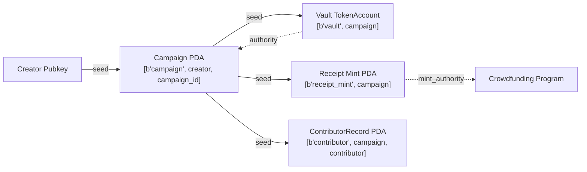

# Architecture Reference

This document is the canonical engineering reference for the multi-chain crowdfunding implementation.
It covers both the EVM (Solidity + Hardhat) and Solana (Anchor) variants and is intended to be
read alongside `docs/scope.md` and `docs/setup.md`.

---

## 1. Overview

Two blockchain platforms implement an identical crowdfunding state machine:

| Dimension | EVM V1 (ERC-20) | EVM V2 (ERC-4626) | EVM V3 (ERC-1155) | Solana V4 (SPL) | Solana V5 (Token-2022) |
|-----------|-----------------|-------------------|-------------------|-----------------|------------------------|
| Token standard | ERC-20 receipt token per campaign | ERC-4626 — campaign IS the vault share token | ERC-1155 — one token ID per tier (Bronze/Silver/Gold) | SPL Token (fungible) | Token-2022 (fungible, `TokenzQdBNbLqP5VEhdkAS6EPFLC1PHnBqCXEpPxuEb`) |
| Deployment model | One singleton per campaign + separate `CampaignToken` | One singleton per campaign (no separate token) | One singleton per campaign + separate `CampaignTierToken` | One program; one Campaign PDA per campaign | Separate Anchor program (`crowdfunding_token2022`); one Campaign PDA per campaign |
| Payment asset | ERC-20 (e.g. USDC) | ERC-20 (`asset()`) | ERC-20 | SPL token (`payment_mint`) | Token-2022 mint (`payment_mint`) |
| Contribute signature | `contribute(uint256 amount)` | `contribute(uint256 amount)` | `contribute(uint256 tierId)` | `contribute(u64 amount)` | `contribute(u64 amount)` |
| Refund signature | `refund()` | `refund()` | `refund(uint256 tierId)` | `refund()` | `refund()` |
| Finality model | Probabilistic (~12 s mainnet) | Probabilistic (~12 s mainnet) | Probabilistic (~12 s mainnet) | Optimistic (400 ms slots, ~2–3 s finality) | Optimistic (400 ms slots, ~2–3 s finality) |
| Solidity / Toolchain | 0.8.24 / Hardhat 2.22.x | 0.8.24 / Hardhat 2.22.x | 0.8.24 / Hardhat 2.22.x | Anchor 0.32.1 / @solana/web3.js | Anchor 0.32.1 / @solana/web3.js |

Both variants expose the same lifecycle — `create → fund → finalize → success/fail` — with
identical campaign parameters, invariants, and event semantics. This controlled parallelism is
the basis for the comparative analysis in the thesis.

---

## 2. State Machine

### 2.1 Diagram

```mermaid
stateDiagram-v2
    [*] --> Created : createCampaign() / initialize_campaign()

    Created --> Funding : implicit — campaign is live on deploy/create

    Funding --> Finalized : finalize() / finalize()\n[guard: block.timestamp > deadline\n / Clock::get().unix_timestamp > deadline]

    Finalized --> Success : [totalRaised >= softCap]
    Finalized --> Failed  : [totalRaised < softCap]

    Success --> Success : withdrawMilestone() / withdraw_milestone()\n[guard: currentMilestone < milestoneCount]
    Failed  --> Failed  : refund() / refund()\n[guard: contribution > 0]

    Success --> [*] : all milestones withdrawn
    Failed  --> [*] : all contributors refunded
```

### 2.2 State Definitions

States are **logical** — derived from stored field values, not a dedicated enum. This avoids
enum migration complexity and simplifies upgrade paths.

| Logical State | Derivation (EVM) | Derivation (Solana) |
|---------------|-----------------|---------------------|
| `Created` | Contract just deployed; `block.timestamp <= deadline && totalRaised == 0` | PDA initialised; `clock < deadline && total_raised == 0` |
| `Funding` | `block.timestamp <= deadline` | `clock.unix_timestamp <= deadline` |
| `Finalized` | `finalized == true` (bool flag set once) | `campaign.finalized == true` |
| `Success` | `finalized == true && totalRaised >= softCap` | `finalized && success == true` |
| `Failed` | `finalized == true && totalRaised < softCap` | `finalized && success == false` |

### 2.3 Transitions

| Transition | Trigger | Guard |
|------------|---------|-------|
| Created → Funding | Campaign deployed / PDA initialised | Implicit — campaign is live immediately |
| Funding → Finalized | `finalize()` / `finalize()` called | `timestamp > deadline` |
| Finalized → Success | Part of `finalize` execution | `totalRaised >= softCap` |
| Finalized → Failed | Part of `finalize` execution | `totalRaised < softCap` |
| Success → Success | `withdrawMilestone()` / `withdraw_milestone()` | `currentMilestone < milestoneCount` |
| Failed → Failed | `refund()` / `refund()` | `contribution[caller] > 0` |
| Success → terminal | Last `withdrawMilestone` called | `currentMilestone == milestoneCount` |
| Failed → terminal | Last contributor refunded | All `contributions` zeroed |

### 2.4 Double-Finalization Prevention

- **EVM**: `require(!finalized, "Already finalized")` at the top of `finalize()`. The `finalized`
  boolean is set to `true` before any state-dependent logic executes (CEI pattern).
- **Solana**: `require!(!campaign.finalized, CrowdfundingError::AlreadyFinalized)` at the top of
  `finalize`. Anchor's account constraint `#[account(mut)]` does not prevent re-entry on
  its own — the explicit bool check is mandatory.

---

## 3. Shared Campaign Parameters

All parameters are set at creation and are immutable thereafter.

| Parameter | EVM type | Solana type | Mutable? | Description |
|-----------|----------|-------------|----------|-------------|
| `softCap` / `soft_cap` | `uint256 immutable` | `u64` | No | Minimum raise for success |
| `hardCap` / `hard_cap` | `uint256 immutable` | `u64` | No | Maximum raise; contributions rejected above this |
| `deadline` / `deadline` | `uint256 immutable` | `i64` | No | Unix timestamp; funding closes after this |
| `creator` | `address immutable` | `Pubkey` | No | Campaign owner; receives milestone withdrawals |
| `milestonePercentages` / `milestones` | `uint8[]` | `[u8; 10]` + `milestone_count: u8` | No | Array of percentages summing to 100 (Solana uses fixed-size array with separate count) |

Runtime mutable fields:

| Field | EVM type | Solana type | Description |
|-------|----------|-------------|-------------|
| `totalRaised` / `total_raised` | `uint256` | `u64` | Cumulative funds received |
| `finalized` | `bool` | `bool` | Set once on `finalize`; cannot be unset |
| `success` | `bool` | `bool` | Set on `finalize` based on softCap comparison |
| `currentMilestone` / `current_milestone` | `uint8` | `u8` | Index of next milestone to withdraw |

---

## 4. Function / Instruction Mapping

| EVM V1 Function | EVM V2 Function | EVM V3 Function | Solana V4/V5 Instruction | Caller | Description |
|-----------------|-----------------|-----------------|--------------------------|--------|-------------|
| `createCampaign(...)` via Factory | `createCampaign(...)` via Factory4626 | `createCampaign(...)` via Factory1155 | `initialize_campaign(...)` | Anyone (deployer) | Initialise campaign |
| `contribute(amount)` | `contribute(amount)` | `contribute(tierId)` | `contribute(amount)` | Any signer | Contribute; mint receipt / vault share / tier token |
| `finalize()` | `finalize()` | `finalize()` | `finalize()` | Anyone (permissionless) | Compute outcome after deadline |
| `withdrawMilestone()` | `withdrawMilestone()` | `withdrawMilestone()` | `withdraw_milestone()` | Creator only | Release next milestone tranche |
| `refund()` | `refund()` | `refund(tierId)` | `refund()` | Contributor | Return contribution if campaign failed |

> **V4 vs V5 instruction parity**: V5 (`crowdfunding_token2022`) exposes identical instructions with the same signatures as V4 (`crowdfunding`). The only differences are internal: V5 uses `anchor_spl::token_2022` CPI calls, `Token2022` program type, and `anchor_spl::token_interface::{Mint, TokenAccount}` interface types. PDA seeds, account layouts, and business logic are unchanged.

> **V3 refund(tierId):** ERC-1155 refunds are per-tier. A contributor who holds Bronze and Silver
> tokens can refund Bronze (tierId=0) without affecting their Silver holding. Multiple refund calls
> are required to recover multiple tier contributions.

> **Naming rationale**: All variants use the same verb roots (`contribute`, `finalize`, `refund`,
> `withdrawMilestone`) for cross-variant mental mapping.

---

## 4a. Client Layer Architecture

The thesis includes three integration client layers — TypeScript, .NET, and Python — that
interact with all implemented contract variants at each stage. Client support is stage-aware:
it grows as new variants are implemented. A client's inability to reach a variant at a given
stage is a temporary implementation-stage limitation, not the intended final design.

### 4a.1 Stage-Aware Coverage

| Stage | TypeScript client | .NET client | Python client |
|-------|-----------------|-------------|---------------|
| MVP (V1 ERC-20 + V4 SPL) | viem — EVM ERC-20; Anchor TS + @solana/web3.js — Solana SPL | Nethereum — EVM ERC-20; Solana.NET / JSON-RPC — Solana SPL | web3.py — EVM ERC-20; anchorpy — Solana SPL |
| Full thesis scope (V1–V5) | Extended adapter per EVM variant (ERC-4626, ERC-1155) + Token-2022 Solana (V5) | Extended adapter per EVM variant (ERC-4626, ERC-1155) + Token-2022 Solana (V5) | V1/V2/V3 branching in `evm/contribute.py`; V4/V5 branching in `solana/contribute.py` |

> **Design intent**: All three client layers are intended to support every variant that exists
> at the current implementation stage. The current repository layout (`clients/ts/`,
> `clients/dotnet/`, `clients/python/`) covers all five variants; V2/V3/V5 branching in the
> TypeScript and .NET layers is partially implemented and complete in Python.

> **Python client as library**: `clients/python/` doubles as a library imported directly by
> `benchmarks/run_tests.py` and `benchmarks/throughput_test.py`. The benchmark orchestration
> imports `clients.python.evm.client` and `clients.python.solana.client` for in-process
> measurement. It can also be driven as a subprocess via `run_client_benchmark.py --client python`.

### 4a.2 Canonical Client Operations

All three client layers expose the same five canonical operations regardless of chain or variant.
The underlying transport (viem, Anchor TS, Nethereum, Solana.NET, web3.py, anchorpy) is
selected per variant.

| Operation | TypeScript | .NET | Python |
|-----------|-----------|------|--------|
| Create campaign | `createCampaign(params)` | `CampaignService.CreateCampaign(params)` | `python -m clients.python evm:create_campaign` |
| Contribute | `contribute(amount)` | `CampaignService.Contribute(amount)` | `python -m clients.python evm:contribute --amount N` |
| Finalize | `finalize()` | `CampaignService.Finalize()` | `python -m clients.python evm:finalize` |
| Withdraw milestone | `withdrawMilestone()` | `CampaignService.WithdrawMilestone()` | `python -m clients.python evm:withdraw` |
| Refund | `refund()` | `CampaignService.Refund()` | `python -m clients.python evm:refund` |

Prefix `sol:` instead of `evm:` for Solana operations (e.g. `python -m clients.python sol:contribute --amount N`).

This uniform operation surface is the basis for the integration complexity metric in the
Developer Experience evaluation. It also means that benchmarking scripts can drive any
client layer against either chain without changing the operation names.

---

## 5. EVM Storage Layout

The EVM contract follows the **singleton** pattern — one `CrowdfundingCampaign` instance per
campaign. A `CrowdfundingFactory` contract deploys these singletons and maintains a registry,
but does not proxy calls.

```
CrowdfundingCampaign.sol storage
┌─────────────────────────────────────────────────────────────────┐
│ Immutables (stored in bytecode, not storage slots)              │
│   address   public immutable creator                            │
│   IERC20    public immutable paymentToken                       │
│   uint256   public immutable softCap                            │
│   uint256   public immutable hardCap                            │
│   uint256   public immutable deadline                           │
├─────────────────────────────────────────────────────────────────┤
│ Storage slots (state variables)                                 │
│   slot 0:  uint256  totalRaised                                 │
│   slot 1:  bool     finalized                                   │
│   slot 1:  bool     successful      (packed with finalized)     │
│   slot 1:  uint8    currentMilestone (packed)                   │
│   slot 2:  uint256  totalWithdrawn                              │
│   uint8[]  milestonePercentages     (dynamic — D6)              │
│   mapping(address => uint256) contributions  (keccak slot)      │
│   CampaignToken  receiptToken       (storage — D7)              │
└─────────────────────────────────────────────────────────────────┘
```

### 5.1 Field Details

| Field | Type | Visibility | Notes |
|-------|------|------------|-------|
| `creator` | `address` | `public immutable` | Set in constructor; cannot change |
| `paymentToken` | `IERC20` | `public immutable` | ERC-20 token used for contributions |
| `softCap` | `uint256` | `public immutable` | In payment token units |
| `hardCap` | `uint256` | `public immutable` | In payment token units; `hardCap >= softCap` enforced at construction |
| `deadline` | `uint256` | `public immutable` | `block.timestamp` unit; must be in the future |
| `milestonePercentages` | `uint8[]` | `public` | Storage array (D6: `immutable` unsupported for dynamic arrays); `sum == 100` validated at construction |
| `receiptToken` | `CampaignToken` | `public` | ERC-20 deployed in constructor; stored in storage (D7: address known only post-deploy) |
| `totalRaised` | `uint256` | `public` | Incremented on each `contribute` call |
| `finalized` | `bool` | `public` | Written once; `true` after `finalize()` |
| `successful` | `bool` | `public` | Written once during `finalize()` |
| `currentMilestone` | `uint8` | `public` | 0-indexed; incremented on each successful `withdrawMilestone` |
| `totalWithdrawn` | `uint256` | `public` | Cumulative amount transferred to creator |
| `contributions` | `mapping(address ⇒ uint256)` | `public` | Zeroed on refund (CEI) |

### 5.2 Overflow and Arithmetic

Solidity 0.8.x reverts on integer overflow by default. No `SafeMath` import is required.
The optimizer is enabled at `runs: 200` (balanced deploy/call cost).

---

## 5a. EVM V2 Storage Layout (ERC-4626)

`CrowdfundingCampaign4626` extends OZ `ERC4626` (which extends `ERC20`). The campaign
contract IS the vault share token — no `receiptToken` field is needed.

```
CrowdfundingCampaign4626.sol storage (inherits ERC20 + ERC4626 slots)
┌─────────────────────────────────────────────────────────────────┐
│ ERC20 inherited storage (OZ internal)                           │
│   mapping(address => uint256) _balances   (share balances)      │
│   mapping(address => ...) _allowances                           │
│   uint256 _totalSupply                                          │
│   string  _name, _symbol                                        │
├─────────────────────────────────────────────────────────────────┤
│ ERC4626 inherited storage                                        │
│   IERC20 _asset          (underlying payment token)             │
│   uint8  _underlyingDecimals                                    │
├─────────────────────────────────────────────────────────────────┤
│ Campaign immutables (bytecode)                                   │
│   address   creator                                             │
│   uint256   softCap, hardCap, deadline                          │
├─────────────────────────────────────────────────────────────────┤
│ Campaign storage (identical slot layout to V1)                   │
│   slot 0:  uint256  totalRaised                                 │
│   slot 1:  bool     finalized + bool successful + uint8 current │
│   slot 2:  uint256  totalWithdrawn                              │
│   uint8[]  milestonePercentages (dynamic)                       │
│   mapping(address => uint256) contributions                     │
│ (no receiptToken field — campaign IS the ERC-20 share token)    │
└─────────────────────────────────────────────────────────────────┘
```

**Key V2 design choices:**
- Standard ERC-4626 entry points disabled: `deposit`, `mint`, `withdraw`, `redeem` → revert
- `maxDeposit / maxMint / maxWithdraw / maxRedeem` → return 0
- `contribute(amount)` calls `_mint` directly; `refund()` calls `_burn` directly
- `asset()` (from ERC4626) replaces `paymentToken` — returns address of underlying token

---

## 5b. EVM V3 Storage Layout (ERC-1155)

`CrowdfundingCampaign1155` does not extend any token standard — it deploys a separate
`CampaignTierToken` (ERC-1155) and holds a reference to it.

```
CrowdfundingCampaign1155.sol storage
┌─────────────────────────────────────────────────────────────────┐
│ Immutables (bytecode)                                           │
│   address   creator                                             │
│   IERC20    paymentToken                                        │
│   uint256   softCap, hardCap, deadline                          │
├─────────────────────────────────────────────────────────────────┤
│ Storage (same base slots as V1)                                 │
│   slot 0:  uint256  totalRaised                                 │
│   slot 1:  bool     finalized + bool successful + uint8 current │
│   slot 2:  uint256  totalWithdrawn                              │
│   uint8[]  milestonePercentages (dynamic)                       │
│   mapping(address => uint256) contributions  (total USDC)       │
├─────────────────────────────────────────────────────────────────┤
│ Tier-specific storage                                           │
│   Tier[3]  tiers  (price: uint256, name: string)               │
│   CampaignTierToken  tierToken   (ERC-1155 contract reference)  │
│   mapping(address => mapping(uint256 => uint256))               │
│       tierContributions  (contributor → tierId → count held)    │
└─────────────────────────────────────────────────────────────────┘

CampaignTierToken.sol (separate contract, extends ERC1155)
┌─────────────────────────────────────────────────────────────────┐
│   address  campaign  (immutable; only this address may mint/burn)│
│   ERC1155 inherited storage (_balances, etc.)                   │
└─────────────────────────────────────────────────────────────────┘
```

**Tier IDs:**
| ID | Name | Example price |
|----|------|--------------|
| 0 | Bronze | 100 USDC |
| 1 | Silver | 500 USDC |
| 2 | Gold | 1,000 USDC |

**Key V3 design choices:**
- `contribute(tierId)` derives `amount = tiers[tierId].price`; rejects `tierId >= 3`
- `refund(tierId)` is per-tier; each call burns 1 ERC-1155 token and returns one tier price
- `contributions[addr]` (total USDC) tracks the aggregate for softCap/hardCap accounting
- `tierContributions[addr][tierId]` tracks how many tokens of each tier the contributor holds

---

## 6. Solana Account Layout

Solana programs store state in separate accounts rather than contract storage slots. The
crowdfunding program uses two account types.

### 6.1 Campaign Account

Derived as a PDA (see §7). One per campaign.

```
Campaign account layout (Anchor-serialised, Borsh)
┌──────────────────────────────────────────────────────────┐
│  discriminator              8 bytes  (Anchor type tag)   │
│  creator          Pubkey   32 bytes                      │
│  payment_mint     Pubkey   32 bytes                      │
│  receipt_mint     Pubkey   32 bytes                      │
│  soft_cap         u64       8 bytes                      │
│  hard_cap         u64       8 bytes                      │
│  deadline         i64       8 bytes  (Unix timestamp)    │
│  total_raised     u64       8 bytes                      │
│  finalized        bool      1 byte                       │
│  successful       bool      1 byte                       │
│  current_milestone  u8      1 byte                       │
│  total_withdrawn  u64       8 bytes                      │
│  milestone_count  u8        1 byte                       │
│  milestones       [u8; 10] 10 bytes  (fixed array)       │
│  campaign_id      u64       8 bytes                      │
│  bump             u8        1 byte   (Campaign PDA bump) │
│  vault_bump       u8        1 byte   (Vault PDA bump)    │
│  receipt_mint_bump u8       1 byte   (Mint PDA bump)     │
├──────────────────────────────────────────────────────────┤
│  Data (excl. discriminator): 161 bytes                   │
│  Total (with discriminator): 169 bytes                   │
│  Anchor space allocation: 256 bytes (headroom)           │
└──────────────────────────────────────────────────────────┘
```

### 6.2 ContributorRecord Account

Derived as a PDA per (campaign, contributor) pair. One per unique contributor per campaign.

```
ContributorRecord account layout
┌─────────────────────────────────────────────────────────┐
│  discriminator   8 bytes                                │
│  campaign        Pubkey  32 bytes                       │
│  contributor     Pubkey  32 bytes                       │
│  amount          u64      8 bytes   (lamports)          │
│  bump            u8       1 byte                        │
├─────────────────────────────────────────────────────────┤
│  Total: 81 bytes                                        │
│  Recommended alloc: 96 bytes                            │
└─────────────────────────────────────────────────────────┘
```

---

## 7. Solana PDA Seed Design

### 7.1 PDA Relationships



> **Note on Vault**: The payment asset is a SPL token (fungible token on `payment_mint`).
> The vault is a dedicated SPL `TokenAccount` PDA (`["vault", campaign.key()]`) whose authority
> is the Campaign PDA. This matches the EVM side where the `CrowdfundingCampaign` contract holds
> the ERC-20 payment tokens. The Receipt Mint PDA issues SPL receipt tokens to contributors.

### 7.2 PDA Seed Table

| Account | Seeds | Bump stored in |
|---------|-------|----------------|
| Campaign | `[b"campaign", creator.key(), campaign_id.to_le_bytes()]` | `campaign.bump` |
| Vault | `[b"vault", campaign.key()]` | `campaign.vault_bump` |
| Receipt Mint | `[b"receipt_mint", campaign.key()]` | `campaign.receipt_mint_bump` |
| ContributorRecord | `[b"contributor", campaign.key(), contributor.key()]` | `contributor_record.bump` |

Bumps are stored in the accounts they belong to. This avoids requiring callers to provide bump
values and eliminates a class of bump-grinding attacks.

### 7.3 Authority Model

| Account | Authority type | Held by |
|---------|---------------|---------|
| Campaign PDA | System program owner | Program (via PDA) |
| Receipt Mint | `mint_authority` | Campaign PDA (CPI signer) |
| ContributorRecord | System program owner | Program (via PDA) |

---

## 8. Access Control Matrix

| Operation | EVM actor | Solana actor | Guard |
|-----------|-----------|--------------|-------|
| `createCampaign` / `initialize_campaign` | Deployer (constructor) | Any signer (becomes creator) | `softCap < hardCap`, `deadline > now`, `sum(milestones) == 100` |
| `contribute` / `contribute` | Any address | Any signer | `!finalized`, `timestamp <= deadline`, `totalRaised + amount <= hardCap` |
| `finalize` / `finalize` | Anyone (permissionless) | Anyone (permissionless) | `timestamp > deadline`, `!finalized` |
| `withdrawMilestone` / `withdraw_milestone` | `msg.sender == creator` | `ctx.accounts.creator.key() == campaign.creator` | `success == true`, `currentMilestone < milestones.len()` |
| `refund` / `refund` | `msg.sender` with `contributions[msg.sender] > 0` | Any signer with valid ContributorRecord | `success == false`, `finalized == true`, `amount > 0` |

> **Permissionless finalize**: Anyone can trigger finalization after the deadline. This is a
> deliberate design choice — it prevents the creator from blocking fund recovery by refusing to
> call finalize. See Decision Log §12.

---

## 9. Invariants

These invariants must hold at all times. Each is enforced at the listed point.

1. **totalRaised ≤ hardCap** — enforced in `contribute`; contribution reverts if it would exceed `hardCap`.
2. **finalized is write-once** — enforced by `require(!finalized)` at the top of `finalize`; once set, it cannot be unset.
3. **success and failure are mutually exclusive** — `success` is set exactly once inside `finalize` based on `totalRaised >= softCap`; cannot be changed afterwards.
4. **milestone percentages sum to 100** — enforced at campaign creation; custom error `MilestonePercentageError` on both platforms.
5. **contributions[caller] zeroed before transfer on refund** — CEI (checks-effects-interactions) pattern; prevents reentrancy on EVM; prevents double-claim on Solana.
6. **last milestone uses balance sweep** — the final `withdrawMilestone` transfers the full remaining payment token balance (EVM: `paymentToken.balanceOf(address(this))`; Solana: remaining SPL vault balance) rather than computing `totalRaised * pct / 100`, preventing dust accumulation from integer division.

---

## 10. Edge Cases and Boundary Conditions

| Scenario | Expected behaviour | Guard location |
|----------|--------------------|---------------|
| Contribution at exactly `hardCap` | Accepted; subsequent contributions rejected | `contribute` function |
| Contribution would exceed `hardCap` | Entire transaction reverts; no partial fills | `contribute` function |
| `finalize` called before `deadline` | Reverts with `DeadlineNotReached` | `finalize` function |
| `finalize` called twice | Second call reverts with `AlreadyFinalized` | `finalize` function |
| `withdrawMilestone` called after last milestone | Reverts with `NoMoreMilestones` | `withdrawMilestone` function |
| `refund` called with zero contribution | Reverts with `NothingToRefund` | `refund` function |
| `refund` called twice by same contributor | Second call reverts (contribution zeroed on first call) | CEI pattern in `refund` |
| `softCap == hardCap` | Valid; campaign succeeds exactly at cap or fails | Creation guard: `softCap <= hardCap` |
| Single-milestone campaign (`[100]`) | Last-milestone sweep applies on first withdrawal | `withdrawMilestone` function |
| `deadline` in the past at construction | Reverts with `InvalidDeadline` | Construction / `initialize_campaign` |

---

## 11. Events (EVM) and Logging (Solana)

### 11.1 EVM Events

| Event | Fields | Emitted in |
|-------|--------|-----------|
| `CampaignCreated` | `creator`, `softCap`, `hardCap`, `deadline` | Constructor |
| `Contributed` | `contributor`, `amount`, `totalRaised` | `contribute()` |
| `Finalized` | `successful`, `totalRaised` | `finalize()` |
| `MilestoneWithdrawn` | `milestoneIndex`, `amount`, `recipient` | `withdrawMilestone()` |
| `Refunded` | `contributor`, `amount` | `refund()` |

### 11.2 Solana Logging

Anchor emits structured logs via the `emit!` macro (on-chain CPI event log).

| Event struct | Fields | Emitted in |
|-------------|--------|-----------|
| `CampaignCreated` | `campaign`, `creator`, `soft_cap`, `hard_cap`, `deadline` | `initialize_campaign` |
| `Contributed` | `campaign`, `contributor`, `amount`, `total_raised` | `contribute` |
| `Finalized` | `campaign`, `success`, `total_raised` | `finalize` |
| `MilestoneWithdrawn` | `campaign`, `milestone_index`, `amount` | `withdraw_milestone` |
| `Refunded` | `campaign`, `contributor`, `amount` | `refund` |

> **Note:** Solana program events are planned but not yet implemented. The Anchor program
> currently does not emit structured events via `emit!`. The table above documents the intended
> event surface for parity with EVM. Event emission will be added in a follow-up commit.

---

## 12. Decision Log

### D1 — Factory vs Singleton (EVM)

| | Detail |
|-|--------|
| **Decision** | Singleton: one contract deployed per campaign |
| **Options considered** | (A) Singleton — deploy a new contract for each campaign; (B) Factory — one factory contract clones minimal proxies (EIP-1167) |
| **Tradeoffs** | Singleton: higher deploy gas per campaign, simpler code, no proxy complexity, easier to audit. Factory: lower per-campaign deploy cost, but adds proxy indirection, upgrade risk, and surface area irrelevant to the thesis comparison |
| **Why chosen** | The thesis benchmarks deploy cost as a one-time setup cost, not an ongoing operational cost. Singleton produces cleaner, auditable code that maps 1:1 to the Solana PDA model. Introducing a factory would add asymmetry that complicates the comparative analysis without adding thesis value |

### D2 — Who Can Call Finalize

| | Detail |
|-|--------|
| **Decision** | Anyone can call `finalize` after the deadline (both EVM and Solana) |
| **Options considered** | (A) Creator-only finalize; (B) Permissionless finalize |
| **Tradeoffs** | Creator-only: simpler mental model, but creator can block fund recovery indefinitely. Permissionless: slight griefing surface (gas cost of finalize falls on caller), but enables trustless recovery |
| **Why chosen** | Contributor fund safety takes priority. A creator who refuses to finalize would leave contributor funds locked; permissionless finalize eliminates this attack. The gas cost of finalize is bounded and small. Both EVM and Solana implement this consistently |

### D3 — SPL Token vs Token-2022 (Solana)

| | Detail |
|-|--------|
| **Decision** | SPL Token (classic) for the MVP (V4); Token-2022 as a separate program (V5) for comparison |
| **Options considered** | (A) SPL Token — mature, universal wallet support; (B) Token-2022 — transfer hooks, confidential transfers, interest-bearing extensions; (C) Combined SPL + Token-2022 in one program |
| **Tradeoffs** | SPL Token: maximum tooling compatibility, no extension complexity, Anchor 0.32.1 has first-class support. Token-2022: enables richer receipt token mechanics but adds account size variability and extension CPI complexity. Separate programs enable clean side-by-side benchmarking |
| **Why chosen** | The MVP comparison must isolate platform differences, not feature differences. SPL Token is the direct counterpart of a plain ERC-20. Token-2022 is implemented as a separate variant (V5) so both Solana programs can be benchmarked and compared independently |

### D4 — Canonical Function Naming

| | Detail |
|-|--------|
| **Decision** | Use `contribute / refund / finalize / withdrawMilestone` (EVM) and `initialize_campaign / contribute / finalize / withdraw_milestone / refund` (Solana) |
| **Options considered** | (A) Original canonical draft names: `fund`, `claim_refund`, `finalize_campaign`; (B) Names as implemented |
| **Tradeoffs** | `contribute` is explicit about the crowdfunding action (vs. `fund` which is ambiguous in DeFi context). `refund` is unambiguous in context; `claim_refund` adds no information. Solana `finalize` is sufficient — the program namespace already scopes it to the campaign. Having both platforms use the same verb (`contribute`, `finalize`, `refund`) improves cross-chain mental mapping |
| **Why chosen** | Implemented names were chosen for clarity and cross-chain naming symmetry. Renaming to match the original draft would require updating all tests, clients, and benchmark scripts with no semantic gain |

### D5 — Milestone Percentage Array vs Fixed Splits

| | Detail |
|-|--------|
| **Decision** | `uint8[]` / `Vec<u8>` array of percentages provided at campaign creation |
| **Options considered** | (A) Fixed equal splits (e.g. 50/50); (B) Configurable percentage array summing to 100; (C) Configurable absolute amounts |
| **Tradeoffs** | Fixed splits: trivial to implement, zero configuration surface. Array of percentages: flexible, supports 1-to-N milestones, requires sum validation. Absolute amounts: requires knowing `hardCap` is reached, creates rounding complexity |
| **Why chosen** | The thesis canonical lifecycle specifies milestone-based withdrawal. A fixed split cannot model a single-milestone campaign or a campaign with unequal tranches. Percentages are human-readable and bounded (0–100). Absolute amounts couple milestone config to fundraise outcome, which breaks the `softCap < hardCap` scenario |

### D-V2-1 — ERC-4626 Campaign as Its Own Share Token

| | Detail |
|-|--------|
| **Decision** | The campaign contract extends `ERC4626`; the campaign IS the vault share token. No separate `CampaignToken` is deployed. |
| **Options considered** | (A) Campaign holds a reference to a separate ERC-4626 vault; (B) Campaign IS the ERC-4626 vault token |
| **Tradeoffs** | Separate vault: cleaner separation of concerns, but adds one deploy + one contract interaction per operation. Campaign as vault: eliminates the separate `CampaignToken` deployment cost (~500k gas), reduces address count, and makes `campaign.balanceOf(contributor)` directly readable. Disabling standard ERC-4626 entry points adds code surface but removes ambiguity. |
| **Why chosen** | The thesis benchmarks deployment cost and per-operation cost. Eliminating the separate token deployment is a measurable V2 benefit over V1. It also matches the semantic intent of ERC-4626: the "vault" here is the campaign itself |

### D-V2-2 — Disabling Standard ERC-4626 Entry Points

| | Detail |
|-|--------|
| **Decision** | Override `deposit`, `mint`, `withdraw`, `redeem` to revert with `UseContributeInstead` / `UseRefundInstead`. Override `maxDeposit/maxMint/maxWithdraw/maxRedeem` → 0. |
| **Options considered** | (A) Allow standard ERC-4626 entry points to function alongside `contribute`/`refund`; (B) Disable all standard entry points |
| **Tradeoffs** | Allowing standard entry points: a contributor could deposit via standard ERC-4626 paths, bypassing the `hardCap` and deadline guards — a security hole. Disabling: increases code size but eliminates the bypass attack surface entirely |
| **Why chosen** | Security over convenience. Standard ERC-4626 callers (DeFi routers, aggregators) that check `maxDeposit == 0` will correctly determine this vault does not accept deposits, preventing accidental fund loss |

### D-V3-1 — Fixed 3-Tier ERC-1155 Schema

| | Detail |
|-|--------|
| **Decision** | Three fixed tiers stored in `Tier[3]` (Bronze/Silver/Gold). Tier prices set at campaign creation. |
| **Options considered** | (A) Dynamic N tiers (variable-length array); (B) Fixed 3 tiers; (C) Fixed 3 tiers with per-tier supply caps |
| **Tradeoffs** | Dynamic N tiers: more flexible but complicates refund loop and gas estimation. Fixed 3 tiers: bounded gas on all operations, simpler storage layout, sufficient for thesis comparison. Per-tier supply caps: out of scope |
| **Why chosen** | Three tiers is the canonical crowdfunding tier model (e.g. Bronze/Silver/Gold reward tiers on Kickstarter). Fixing the count at 3 makes the `Tier[3]` storage layout deterministic and keeps `InvalidTierId` checking trivial (`tierId >= 3`). Adding more tiers would not change the architectural conclusion |

### D-V3-2 — Per-Tier Refund vs Full Refund

| | Detail |
|-|--------|
| **Decision** | `refund(uint256 tierId)` refunds one unit of the specified tier. Contributors must call refund once per tier to recover all contributions. |
| **Options considered** | (A) `refund()` (no argument) — refunds all tiers atomically; (B) `refund(tierId)` — per-tier, caller chooses order |
| **Tradeoffs** | Atomic refund: simpler UX (one call), but requires iterating over all tiers on-chain — bounded gas only if tier count is fixed. Per-tier: slightly higher UX burden but aligns with the ERC-1155 token model where each tier is a distinct token, and allows partial refund of one tier while keeping others |
| **Why chosen** | Per-tier refund matches the ERC-1155 semantics (each tier token is independently held and burned). It also enables the partial-refund test case which demonstrates a unique V3 capability vs. V1/V2. With only 3 tiers, the UX burden (≤3 calls) is acceptable |
